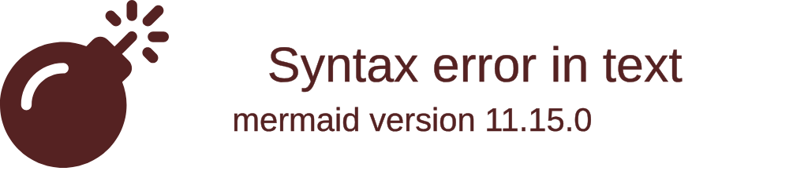
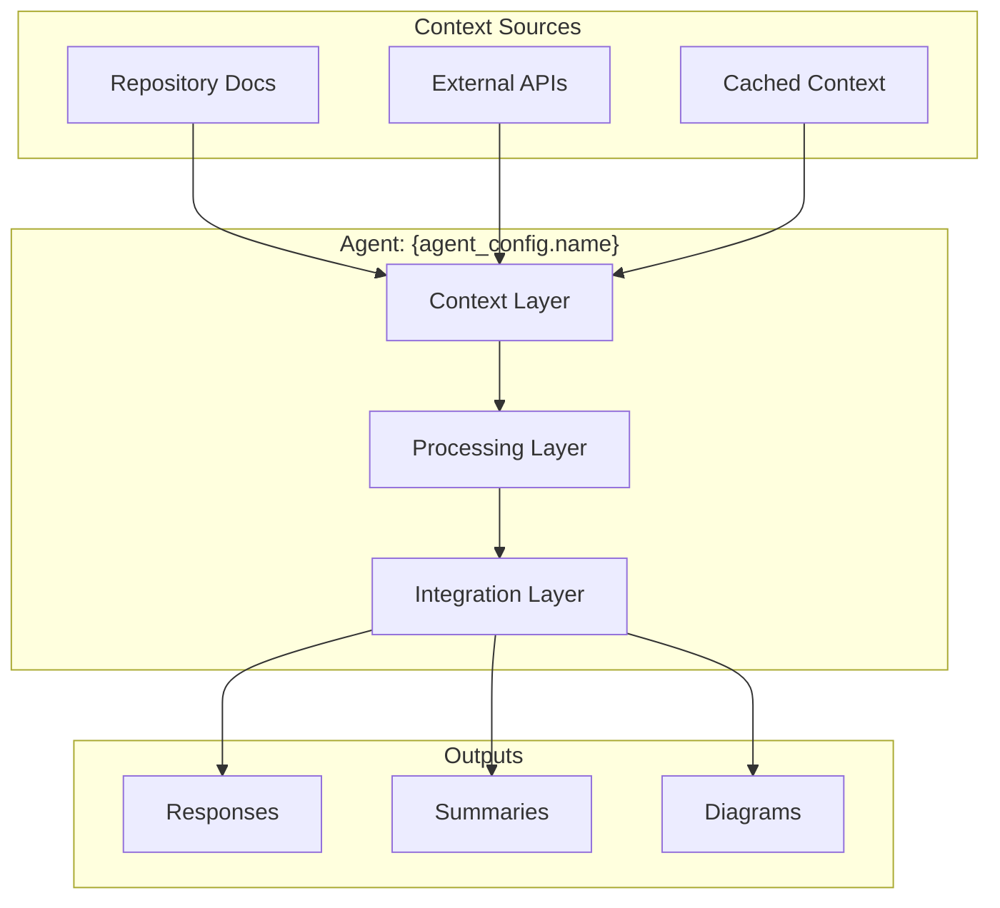

# Integration with Enhanced Create-Specs Workflow

> Created: 2025-08-03
> Version: 1.0.0

## Overview

The `/create-module-agent` command seamlessly integrates with the enhanced create-specs workflow, enabling agents to leverage prompt evolution tracking, executive summaries, mermaid diagrams, and cross-repository references.

## Integration Architecture

### Workflow Connection Points
```mermaid
graph TB
    A[/create-module-agent Command] --> B[Agent Creation]
    B --> C[Context Setup]
    C --> D[Enhanced Specs Integration]
    
    D --> E[Prompt Evolution]
    D --> F[Executive Summaries]
    D --> G[Mermaid Diagrams]
    D --> H[Cross-Repo References]
    D --> I[Task Tracking]
    
    E --> J[Agent Runtime]
    F --> J
    G --> J
    H --> J
    I --> J
    
    J --> K[Enhanced Workflow Execution]
```

## Enhanced Create-Specs Integration

### 1. Workflow Configuration
```yaml
# agents/<module_name>/workflows/enhanced_specs.yaml
integration:
  type: enhanced_create_specs
  version: 2.0.0
  source: "@github:assetutilities/src/modules/agent-os/enhanced-create-specs/"
  
configuration:
  agent_module: ${module_name}
  agent_path: "@agents/${module_name}/"
  
  features:
    prompt_evolution:
      enabled: true
      tracking_file: "@agents/${module_name}/context/prompt_evolution.md"
      summary_format: structured
      
    executive_summaries:
      enabled: true
      auto_generate: true
      include_metrics: true
      format: markdown
      
    mermaid_diagrams:
      enabled: true
      auto_generate: true
      types:
        - flowchart
        - sequence
        - class
        - state
      
    task_tracking:
      enabled: true
      integration: agent_os_tasks
      auto_decompose: true
      
    cross_repo_references:
      enabled: true
      repositories: ${configured_repos}
      auto_link: true
```

### 2. Prompt Evolution Tracking
```python
class PromptEvolutionIntegration:
    """Integrate prompt evolution with agent context"""
    
    def __init__(self, agent_path: Path):
        self.agent_path = agent_path
        self.evolution_file = agent_path / "context" / "prompt_evolution.md"
        self.prompt_history = []
        
    def track_prompt(self, prompt: Prompt, response: Response):
        """Track prompt and response for evolution analysis"""
        
        evolution_entry = {
            "timestamp": datetime.now().isoformat(),
            "prompt": {
                "content": prompt.content,
                "template": prompt.template_name,
                "parameters": prompt.parameters
            },
            "response": {
                "quality_score": self.evaluate_response(response),
                "execution_time": response.execution_time,
                "tokens_used": response.tokens_used
            },
            "improvements": self.suggest_improvements(prompt, response)
        }
        
        self.prompt_history.append(evolution_entry)
        self.update_evolution_file()
        
    def suggest_improvements(self, prompt: Prompt, response: Response) -> List[str]:
        """Analyze and suggest prompt improvements"""
        
        improvements = []
        
        # Analyze response quality
        if response.quality_score < 0.7:
            improvements.append("Consider adding more context or examples")
        
        # Check for ambiguity
        if self.detect_ambiguity(prompt):
            improvements.append("Clarify ambiguous terms or requirements")
        
        # Optimize token usage
        if response.tokens_used > 1000:
            improvements.append("Consider breaking down into smaller prompts")
        
        return improvements
    
    def generate_evolution_summary(self) -> str:
        """Generate summary of prompt evolution"""
        
        summary = f"""
# Prompt Evolution Summary

## Statistics
- Total Prompts: {len(self.prompt_history)}
- Average Quality Score: {self.calculate_average_quality()}
- Most Used Template: {self.get_most_used_template()}

## Evolution Patterns
{self.analyze_evolution_patterns()}

## Recommended Optimizations
{self.generate_optimization_recommendations()}
        """
        
        return summary
```

### 3. Executive Summary Generation
```python
class ExecutiveSummaryIntegration:
    """Generate executive summaries for agent tasks"""
    
    def __init__(self, agent_path: Path):
        self.agent_path = agent_path
        self.summary_template = self.load_summary_template()
        
    def generate_summary(self, task_result: TaskResult) -> ExecutiveSummary:
        """Generate executive summary from task results"""
        
        summary = ExecutiveSummary()
        
        # Extract key points
        summary.key_points = self.extract_key_points(task_result)
        
        # Generate metrics
        summary.metrics = {
            "completion_rate": task_result.completion_percentage,
            "time_spent": task_result.execution_time,
            "resources_used": task_result.resources,
            "quality_score": self.calculate_quality_score(task_result)
        }
        
        # Create visual summary
        summary.visual = self.create_visual_summary(task_result)
        
        # Generate recommendations
        summary.recommendations = self.generate_recommendations(task_result)
        
        return summary
    
    def create_visual_summary(self, task_result: TaskResult) -> str:
        """Create mermaid diagram for visual summary"""
        
        diagram = f"""

        """
        
        return diagram
```

### 4. Mermaid Diagram Integration
```python
class MermaidDiagramIntegration:
    """Generate mermaid diagrams for agent workflows"""
    
    def __init__(self, agent_path: Path):
        self.agent_path = agent_path
        self.diagram_templates = self.load_diagram_templates()
        
    def generate_workflow_diagram(self, workflow: Workflow) -> str:
        """Generate workflow diagram"""
        
        nodes = []
        edges = []
        
        for step in workflow.steps:
            nodes.append(f"{step.id}[{step.name}]")
            
            for dependency in step.dependencies:
                edges.append(f"{dependency} --> {step.id}")
        
        diagram = f"""
```mermaid
flowchart TD
    {chr(10).join(nodes)}
    {chr(10).join(edges)}
```
        """
        
        return diagram
    
    def generate_architecture_diagram(self, agent_config: AgentConfig) -> str:
        """Generate agent architecture diagram"""
        
        diagram = f"""

        """
        
        return diagram
```

### 5. Task Tracking Integration
```python
class TaskTrackingIntegration:
    """Integrate with Agent OS task tracking system"""
    
    def __init__(self, agent_path: Path):
        self.agent_path = agent_path
        self.task_manager = TaskManager()
        
    def decompose_task(self, task_description: str) -> List[Task]:
        """Decompose task into subtasks using agent context"""
        
        # Load agent context
        context = self.load_agent_context()
        
        # Use context to understand task requirements
        requirements = self.analyze_requirements(task_description, context)
        
        # Generate subtasks
        subtasks = []
        for req in requirements:
            subtask = Task(
                name=req.name,
                description=req.description,
                dependencies=req.dependencies,
                estimated_time=req.estimate
            )
            subtasks.append(subtask)
        
        return subtasks
    
    def track_progress(self, task_id: str, status: str):
        """Track task progress"""
        
        self.task_manager.update_status(task_id, status)
        
        # Generate progress visualization
        if status == "completed":
            self.generate_completion_diagram(task_id)
        
        # Update executive summary
        self.update_executive_summary()
```

### 6. Cross-Repository Reference Integration
```python
class CrossRepoIntegration:
    """Handle cross-repository references for agents"""
    
    def __init__(self, agent_path: Path, repositories: List[str]):
        self.agent_path = agent_path
        self.repositories = repositories
        self.reference_cache = {}
        
    def resolve_reference(self, reference: str) -> Any:
        """Resolve cross-repository reference"""
        
        # Parse reference format: @github:repo/path
        if reference.startswith("@github:"):
            repo, path = self.parse_github_reference(reference)
            
            # Check cache
            cache_key = f"{repo}:{path}"
            if cache_key in self.reference_cache:
                return self.reference_cache[cache_key]
            
            # Fetch from repository
            content = self.fetch_from_repo(repo, path)
            
            # Cache result
            self.reference_cache[cache_key] = content
            
            return content
        
        # Handle other reference types
        return self.resolve_local_reference(reference)
    
    def create_reference_map(self) -> Dict:
        """Create map of all cross-repository references"""
        
        reference_map = {}
        
        for repo in self.repositories:
            reference_map[repo] = {
                "specs": f"@github:{repo}/specs/",
                "docs": f"@github:{repo}/docs/",
                "src": f"@github:{repo}/src/",
                "examples": f"@github:{repo}/examples/"
            }
        
        return reference_map
```

## Runtime Integration

### Agent Initialization with Enhanced Features
```python
class EnhancedAgent:
    """Agent with enhanced create-specs integration"""
    
    def __init__(self, module_name: str):
        self.module_name = module_name
        self.agent_path = Path(f"agents/{module_name}")
        
        # Load integrations
        self.prompt_evolution = PromptEvolutionIntegration(self.agent_path)
        self.executive_summary = ExecutiveSummaryIntegration(self.agent_path)
        self.mermaid_diagrams = MermaidDiagramIntegration(self.agent_path)
        self.task_tracking = TaskTrackingIntegration(self.agent_path)
        self.cross_repo = self.load_cross_repo_integration()
        
    def execute_task(self, task: str) -> TaskResult:
        """Execute task with enhanced features"""
        
        # Decompose task
        subtasks = self.task_tracking.decompose_task(task)
        
        # Create workflow diagram
        workflow_diagram = self.mermaid_diagrams.generate_workflow_diagram(
            Workflow(subtasks)
        )
        
        # Execute subtasks
        results = []
        for subtask in subtasks:
            # Track prompt
            prompt = self.generate_prompt(subtask)
            self.prompt_evolution.track_prompt(prompt, response)
            
            # Execute
            result = self.execute_subtask(subtask)
            results.append(result)
            
            # Update tracking
            self.task_tracking.track_progress(subtask.id, result.status)
        
        # Generate executive summary
        task_result = TaskResult(results)
        summary = self.executive_summary.generate_summary(task_result)
        
        # Create final report
        report = self.generate_report(task_result, summary, workflow_diagram)
        
        return report
```

### Workflow Execution Pipeline
```python
def execute_enhanced_workflow(agent: EnhancedAgent, spec: Spec):
    """Execute enhanced create-specs workflow with agent"""
    
    # Phase 1: Planning
    plan = agent.create_execution_plan(spec)
    plan_diagram = agent.mermaid_diagrams.generate_workflow_diagram(plan)
    
    # Phase 2: Context Gathering
    context = agent.gather_context(spec)
    context_summary = agent.executive_summary.summarize_context(context)
    
    # Phase 3: Task Execution
    for task in plan.tasks:
        # Resolve cross-repo references
        task.references = agent.cross_repo.resolve_references(task.references)
        
        # Execute with tracking
        result = agent.execute_task(task)
        
        # Track evolution
        agent.prompt_evolution.track_task_execution(task, result)
    
    # Phase 4: Summary Generation
    final_summary = agent.generate_final_summary(spec, plan, results)
    
    # Phase 5: Documentation
    documentation = {
        "spec": spec,
        "plan": plan_diagram,
        "context": context_summary,
        "results": results,
        "summary": final_summary,
        "evolution": agent.prompt_evolution.generate_evolution_summary()
    }
    
    return documentation
```

## Configuration Management

### Agent Configuration with Enhanced Features
```yaml
# agents/<module_name>/config.yaml
agent:
  name: ${module_name}_agent
  version: 1.0.0
  
enhanced_features:
  prompt_evolution:
    enabled: true
    auto_optimize: true
    optimization_threshold: 0.7
    
  executive_summaries:
    enabled: true
    auto_generate: true
    format: structured_markdown
    include_visualizations: true
    
  mermaid_diagrams:
    enabled: true
    auto_generate: true
    diagram_types:
      - workflow
      - architecture
      - sequence
      - state
    
  task_tracking:
    enabled: true
    auto_decompose: true
    max_subtask_depth: 3
    progress_notifications: true
    
  cross_repo_references:
    enabled: true
    repositories:
      - assetutilities
      - pyproject-starter
      - ${additional_repos}
    cache_references: true
    refresh_interval: 24h
```

### Integration Hooks
```python
class IntegrationHooks:
    """Hooks for enhanced workflow integration"""
    
    @hook("pre_task_execution")
    def prepare_context(self, task: Task):
        """Prepare context before task execution"""
        
        # Load optimized context
        context = self.load_optimized_context()
        
        # Resolve references
        task.references = self.resolve_all_references(task)
        
        # Generate initial diagrams
        self.generate_planning_diagrams(task)
    
    @hook("post_task_execution")
    def process_results(self, task: Task, result: TaskResult):
        """Process results after task execution"""
        
        # Track prompt evolution
        self.track_prompt_performance(task, result)
        
        # Generate summary
        self.generate_task_summary(result)
        
        # Update progress tracking
        self.update_progress_tracking(task, result)
    
    @hook("on_workflow_completion")
    def finalize_workflow(self, workflow: Workflow):
        """Finalize workflow execution"""
        
        # Generate complete documentation
        self.generate_workflow_documentation(workflow)
        
        # Create evolution report
        self.create_evolution_report(workflow)
        
        # Update agent learning
        self.update_agent_context(workflow)
```