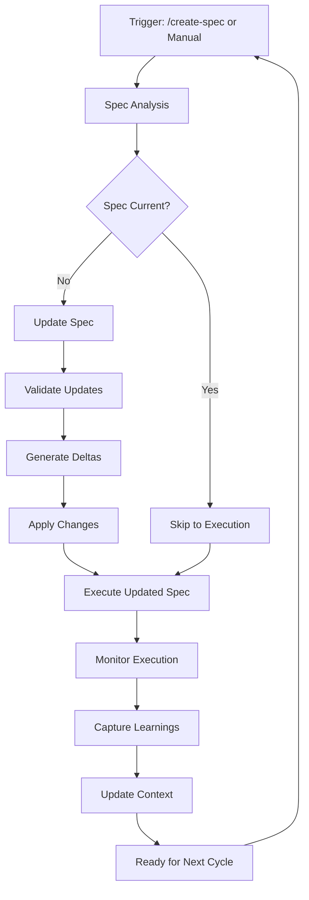

# Workflow Refresh: Continuous Spec Update and Execution

> Created: 2025-08-04
> Version: 1.0.0

## Overview

The workflow refresh system provides a continuous cycle of spec updating and execution, ensuring that specifications remain current with implementation changes and that execution follows the latest spec updates. This becomes the default behavior for all repository `/create-spec` slash commands.

## Workflow Refresh Cycle

### Complete Refresh Pipeline


## Spec Update Detection

### Change Detection System
```python
class SpecChangeDetector:
    """Detect changes requiring spec updates"""
    
    def __init__(self, spec_path: Path):
        self.spec_path = spec_path
        self.spec_hash = self.calculate_spec_hash()
        self.implementation_hash = self.calculate_implementation_hash()
        
    def detect_changes(self) -> ChangeReport:
        """Detect all changes affecting the spec"""
        
        changes = ChangeReport()
        
        # Check implementation changes
        impl_changes = self.check_implementation_changes()
        if impl_changes:
            changes.add_implementation_changes(impl_changes)
        
        # Check dependency updates
        dep_changes = self.check_dependency_changes()
        if dep_changes:
            changes.add_dependency_changes(dep_changes)
        
        # Check external documentation updates
        doc_changes = self.check_documentation_changes()
        if doc_changes:
            changes.add_documentation_changes(doc_changes)
        
        # Check cross-repository changes
        repo_changes = self.check_repository_changes()
        if repo_changes:
            changes.add_repository_changes(repo_changes)
        
        return changes
    
    def check_implementation_changes(self) -> List[Change]:
        """Check for implementation drift from spec"""
        
        changes = []
        
        # Scan source files
        source_files = self.get_implementation_files()
        for file in source_files:
            current_hash = self.hash_file(file)
            if current_hash != self.get_cached_hash(file):
                change = self.analyze_file_change(file)
                changes.append(change)
        
        return changes
    
    def analyze_file_change(self, file: Path) -> Change:
        """Analyze specific file changes"""
        
        change = Change()
        change.file = file
        change.type = self.determine_change_type(file)
        
        # Extract semantic changes
        if change.type == "api_change":
            change.details = self.extract_api_changes(file)
        elif change.type == "logic_change":
            change.details = self.extract_logic_changes(file)
        elif change.type == "dependency_change":
            change.details = self.extract_dependency_changes(file)
        
        return change
```

### Automatic Spec Updates
```python
class SpecUpdater:
    """Automatically update specs based on detected changes"""
    
    def __init__(self, spec_path: Path):
        self.spec_path = spec_path
        self.spec = self.load_spec()
        
    def update_spec(self, changes: ChangeReport) -> UpdatedSpec:
        """Update spec based on detected changes"""
        
        updated_spec = self.spec.copy()
        
        # Update based on change types
        for change in changes.all_changes():
            if change.type == "api_change":
                self.update_api_spec(updated_spec, change)
            elif change.type == "feature_addition":
                self.update_feature_spec(updated_spec, change)
            elif change.type == "dependency_update":
                self.update_dependency_spec(updated_spec, change)
            elif change.type == "workflow_change":
                self.update_workflow_spec(updated_spec, change)
        
        # Validate updates
        validation_result = self.validate_updates(updated_spec)
        if not validation_result.is_valid:
            updated_spec = self.resolve_conflicts(updated_spec, validation_result)
        
        return updated_spec
    
    def update_api_spec(self, spec: Spec, change: Change):
        """Update API specifications"""
        
        # Find relevant API section
        api_section = spec.get_section("api")
        
        # Update endpoints
        for endpoint_change in change.details.endpoints:
            if endpoint_change.action == "added":
                api_section.add_endpoint(endpoint_change.endpoint)
            elif endpoint_change.action == "modified":
                api_section.update_endpoint(endpoint_change.endpoint)
            elif endpoint_change.action == "removed":
                api_section.remove_endpoint(endpoint_change.endpoint)
        
        # Update schemas
        for schema_change in change.details.schemas:
            api_section.update_schema(schema_change)
```

## Execution Pipeline

### Continuous Execution Framework
```python
class ContinuousExecutor:
    """Execute specs with continuous updates"""
    
    def __init__(self, spec_path: Path):
        self.spec_path = spec_path
        self.executor = SpecExecutor()
        self.monitor = ExecutionMonitor()
        
    def execute_with_refresh(self, spec: Spec) -> ExecutionResult:
        """Execute spec with refresh capability"""
        
        # Create execution plan
        plan = self.create_execution_plan(spec)
        
        # Start execution with monitoring
        execution_id = self.start_execution(plan)
        
        # Monitor and adapt during execution
        while not self.is_complete(execution_id):
            # Check for spec updates
            if self.has_spec_updates():
                plan = self.adapt_plan(plan, self.get_spec_updates())
            
            # Execute next step
            step_result = self.execute_next_step(plan)
            
            # Monitor results
            self.monitor.track_step(step_result)
            
            # Learn from execution
            self.capture_learnings(step_result)
        
        # Generate final report
        return self.generate_execution_report(execution_id)
    
    def adapt_plan(self, plan: ExecutionPlan, updates: SpecUpdates) -> ExecutionPlan:
        """Adapt execution plan based on spec updates"""
        
        adapted_plan = plan.copy()
        
        # Incorporate new requirements
        for requirement in updates.new_requirements:
            adapted_plan.add_task(self.create_task_from_requirement(requirement))
        
        # Modify existing tasks
        for modification in updates.modifications:
            task = adapted_plan.get_task(modification.task_id)
            task.update(modification.changes)
        
        # Reorder based on new dependencies
        adapted_plan.reorder_tasks()
        
        return adapted_plan
```

### Learning and Adaptation
```python
class LearningSystem:
    """Learn from execution and improve specs"""
    
    def __init__(self):
        self.learning_db = LearningDatabase()
        self.pattern_analyzer = PatternAnalyzer()
        
    def capture_execution_learnings(self, result: ExecutionResult):
        """Capture learnings from execution"""
        
        learnings = Learnings()
        
        # Analyze success patterns
        success_patterns = self.pattern_analyzer.find_success_patterns(result)
        learnings.add_success_patterns(success_patterns)
        
        # Analyze failure patterns
        failure_patterns = self.pattern_analyzer.find_failure_patterns(result)
        learnings.add_failure_patterns(failure_patterns)
        
        # Extract optimization opportunities
        optimizations = self.identify_optimizations(result)
        learnings.add_optimizations(optimizations)
        
        # Store learnings
        self.learning_db.store(learnings)
        
        # Generate recommendations
        return self.generate_recommendations(learnings)
    
    def apply_learnings_to_spec(self, spec: Spec, learnings: Learnings) -> Spec:
        """Apply learnings to improve spec"""
        
        improved_spec = spec.copy()
        
        # Apply success patterns
        for pattern in learnings.success_patterns:
            improved_spec.incorporate_pattern(pattern)
        
        # Avoid failure patterns
        for pattern in learnings.failure_patterns:
            improved_spec.add_guard_against(pattern)
        
        # Apply optimizations
        for optimization in learnings.optimizations:
            improved_spec.apply_optimization(optimization)
        
        return improved_spec
```

## Integration with /create-spec Command

### Default Workflow Enhancement
```python
class EnhancedCreateSpecCommand:
    """Enhanced /create-spec with workflow refresh"""
    
    def __init__(self):
        self.refresh_enabled = True  # Default enabled
        self.refresh_config = self.load_refresh_config()
        
    def handle_create_spec(self, module_name: str, spec_description: str, **options):
        """Handle /create-spec with workflow refresh"""
        
        # Check for existing spec
        existing_spec = self.find_existing_spec(module_name, spec_description)
        
        if existing_spec:
            # Refresh existing spec
            refreshed_spec = self.refresh_workflow(existing_spec)
            spec_path = refreshed_spec.path
        else:
            # Create new spec
            spec_path = self.create_new_spec(module_name, spec_description)
        
        # Setup continuous refresh
        if self.refresh_enabled:
            self.setup_continuous_refresh(spec_path)
        
        # Execute with monitoring
        result = self.execute_with_refresh(spec_path)
        
        return result
    
    def refresh_workflow(self, spec: Spec) -> Spec:
        """Refresh existing spec workflow"""
        
        # Detect changes
        detector = SpecChangeDetector(spec.path)
        changes = detector.detect_changes()
        
        if changes.has_changes():
            # Update spec
            updater = SpecUpdater(spec.path)
            updated_spec = updater.update_spec(changes)
            
            # Validate updates
            validation = self.validate_spec_updates(updated_spec)
            if validation.is_valid:
                updated_spec.save()
                self.log_refresh(updated_spec, changes)
            else:
                self.handle_validation_failure(validation)
        
        return updated_spec
    
    def setup_continuous_refresh(self, spec_path: Path):
        """Setup continuous refresh for spec"""
        
        config = {
            "refresh_triggers": [
                {"type": "file_change", "paths": ["src/", "specs/"]},
                {"type": "time_interval", "interval": "1w"},  # Weekly interval
                {"type": "execution_complete"},
                {"type": "manual_trigger"}
            ],
            "refresh_actions": [
                "detect_changes",
                "update_spec",
                "validate_updates",
                "execute_if_changed"
            ],
            "learning_enabled": True,
            "auto_optimize": True
        }
        
        self.save_refresh_config(spec_path, config)
        self.start_refresh_monitor(spec_path, config)
```

### Refresh Configuration
```yaml
# Default refresh configuration for all specs
workflow_refresh:
  enabled: true  # Default for all /create-spec commands
  
  detection:
    check_implementation: true
    check_dependencies: true
    check_documentation: true
    check_repositories: true
    interval: 1w  # Check interval (1 week)
    
  update:
    auto_update: true
    require_validation: true
    preserve_custom_sections: true
    merge_strategy: intelligent  # intelligent|conservative|aggressive
    
  execution:
    continuous: true
    adapt_on_change: true
    monitor_progress: true
    capture_learnings: true
    
  learning:
    enabled: true
    pattern_recognition: true
    optimization_suggestions: true
    auto_apply_improvements: false  # Require approval
    
  notifications:
    on_change_detected: true
    on_update_applied: true
    on_execution_complete: true
    on_learning_captured: true
```

## Workflow Refresh Hooks

### Pre and Post Refresh Hooks
```python
class RefreshHooks:
    """Hooks for workflow refresh process"""
    
    @hook("pre_refresh")
    def before_refresh(self, spec: Spec):
        """Execute before refresh starts"""
        
        # Backup current spec
        self.backup_spec(spec)
        
        # Notify stakeholders
        self.notify_refresh_start(spec)
        
        # Prepare environment
        self.prepare_refresh_environment(spec)
    
    @hook("post_change_detection")
    def after_change_detection(self, changes: ChangeReport):
        """Execute after changes detected"""
        
        # Analyze change impact
        impact = self.analyze_impact(changes)
        
        # Generate change summary
        summary = self.generate_change_summary(changes)
        
        # Determine refresh strategy
        strategy = self.determine_refresh_strategy(impact)
        
        return strategy
    
    @hook("post_update")
    def after_spec_update(self, spec: Spec, updates: Updates):
        """Execute after spec updated"""
        
        # Validate consistency
        self.validate_spec_consistency(spec)
        
        # Generate diff report
        diff = self.generate_diff_report(spec, updates)
        
        # Update documentation
        self.update_documentation(spec, diff)
    
    @hook("post_execution")
    def after_execution(self, result: ExecutionResult):
        """Execute after execution completes"""
        
        # Capture metrics
        metrics = self.capture_execution_metrics(result)
        
        # Update learning database
        self.update_learning_database(result, metrics)
        
        # Generate recommendations
        recommendations = self.generate_recommendations(result)
        
        # Schedule next refresh
        self.schedule_next_refresh(result, recommendations)
```

## Monitoring and Reporting

### Refresh Dashboard
```python
class RefreshDashboard:
    """Dashboard for workflow refresh monitoring"""
    
    def generate_dashboard(self, spec_path: Path) -> Dashboard:
        """Generate refresh dashboard"""
        
        dashboard = Dashboard()
        
        # Refresh statistics
        stats = self.get_refresh_stats(spec_path)
        dashboard.add_section("Statistics", self.format_stats(stats))
        
        # Change history
        history = self.get_change_history(spec_path)
        dashboard.add_section("Change History", self.format_history(history))
        
        # Execution metrics
        metrics = self.get_execution_metrics(spec_path)
        dashboard.add_section("Execution Metrics", self.format_metrics(metrics))
        
        # Learning insights
        insights = self.get_learning_insights(spec_path)
        dashboard.add_section("Learning Insights", self.format_insights(insights))
        
        # Visual summary
        diagram = self.generate_refresh_diagram(spec_path)
        dashboard.add_diagram(diagram)
        
        return dashboard
    
    def generate_refresh_diagram(self, spec_path: Path) -> str:
        """Generate mermaid diagram of refresh cycle"""
        
        stats = self.get_refresh_stats(spec_path)
        
        diagram = f"""
```mermaid
graph LR
    subgraph "Refresh Cycle"
        A[Specs: {stats.total_specs}] --> B[Changes: {stats.changes_detected}]
        B --> C[Updates: {stats.updates_applied}]
        C --> D[Executions: {stats.executions_completed}]
        D --> E[Learnings: {stats.learnings_captured}]
        E --> A
    end
    
    subgraph "Current Status"
        F[Active Refreshes: {stats.active_refreshes}]
        G[Pending Updates: {stats.pending_updates}]
        H[Running Executions: {stats.running_executions}]
    end
```
        """
        
        return diagram
```

### Refresh Reports
```python
def generate_refresh_report(spec_path: Path) -> RefreshReport:
    """Generate comprehensive refresh report"""
    
    report = RefreshReport()
    
    # Executive summary
    report.executive_summary = f"""
    ## Workflow Refresh Report
    
    **Spec:** {spec_path}
    **Period:** {report.period}
    **Status:** {report.status}
    
    ### Key Metrics
    - Changes Detected: {report.changes_detected}
    - Updates Applied: {report.updates_applied}
    - Executions Completed: {report.executions_completed}
    - Success Rate: {report.success_rate}%
    
    ### Improvements
    - Performance Gain: {report.performance_gain}%
    - Error Reduction: {report.error_reduction}%
    - Time Saved: {report.time_saved} hours
    """
    
    # Detailed sections
    report.add_section("Change Analysis", analyze_changes(spec_path))
    report.add_section("Update History", get_update_history(spec_path))
    report.add_section("Execution Results", get_execution_results(spec_path))
    report.add_section("Learning Outcomes", get_learning_outcomes(spec_path))
    report.add_section("Recommendations", generate_recommendations(spec_path))
    
    return report
```

## Implementation Checklist

### Integration Steps
- [ ] Add workflow refresh to `/create-module-agent` command
- [ ] Make workflow refresh default for `/create-spec` command
- [ ] Implement change detection system
- [ ] Create automatic spec updater
- [ ] Build continuous execution framework
- [ ] Develop learning and adaptation system
- [ ] Setup monitoring and reporting
- [ ] Configure refresh hooks
- [ ] Create refresh dashboard
- [ ] Document refresh workflow