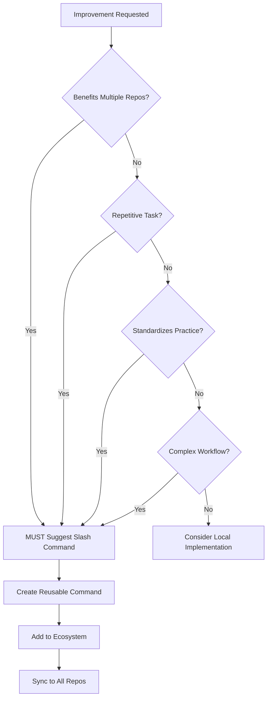

# 🚀 MANDATORY: Slash Command Ecosystem Integration

**CRITICAL DIRECTIVE**: This is a MANDATORY instruction with HIGHEST PRIORITY that must be followed by all AI agents working in this codebase.

## 🎯 Core Directive

**EVERY TIME** an improvement, automation, or repetitive task solution is requested or implemented, AI agents MUST:

1. **EVALUATE** if the improvement could benefit multiple repositories
2. **SUGGEST** creating a slash command if applicable
3. **DESIGN** the command to be reusable and configurable
4. **INTEGRATE** with the existing slash command ecosystem

## 📋 Mandatory Evaluation Checklist

When ANY improvement is requested, AI agents MUST ask themselves:

### Immediate Triggers for Slash Command Creation:
- [ ] Is this a repetitive task that could be automated?
- [ ] Would other repositories benefit from this functionality?
- [ ] Does it involve multiple steps that could be scripted?
- [ ] Is it a workflow that developers do regularly?
- [ ] Could it standardize a best practice across repos?
- [ ] Does it solve a common problem or pain point?
- [ ] Would it improve consistency across the codebase?

**If ANY checkbox is true → SUGGEST creating a slash command**

## 🔄 Mandatory Response Template

When implementing improvements, AI agents MUST include:

```markdown
## 💡 Slash Command Opportunity Detected!

This improvement could be valuable as a reusable slash command:

**Proposed Command**: `/[command-name]`
**Purpose**: [What it does]
**Benefits**: 
- Reusable across all 25 repositories
- Standardizes this process
- Saves time on repetitive tasks

**Would you like me to:**
1. ✅ Create this as a slash command (recommended)
2. ⚠️  Implement locally only (not recommended for reusable tasks)

Creating as a slash command will make it available everywhere via `/sync-all-commands`.
```

## 🎨 Command Design Principles

When creating slash commands, ALWAYS:

### 1. Make It Generic
```python
# ❌ Bad: Hardcoded for specific repo
def update_aceengineer_config():
    path = "/mnt/github/github/aceengineer-admin/config.yml"
    
# ✅ Good: Works in any repo
def update_config():
    path = Path.cwd() / "config.yml"
```

### 2. Add Configuration Options
```python
# ✅ Include parameters for flexibility
parser.add_argument("--config", default="config.yml")
parser.add_argument("--format", choices=["yaml", "json", "toml"])
parser.add_argument("--backup", action="store_true")
```

### 3. Support Multiple Workflows
```python
# ✅ Handle different scenarios
def main():
    if args.all_repos:
        process_all_repositories()
    elif args.current_only:
        process_current_repo()
    else:
        interactive_mode()
```

## 🔍 Improvement Categories That MUST Become Commands

### 1. Code Quality Improvements
- Linting and formatting across files
- Dependency updates and management
- Security scanning and fixes
- Performance optimizations
- Technical debt cleanup

**Example Response**:
```
User: "Can you update all the Python imports to use absolute imports?"
AI: "I can do that! This would be perfect as a slash command `/fix-imports` 
     that could be reused across all repositories..."
```

### 2. Development Workflows
- Build and deployment processes
- Testing automation
- Documentation generation
- Release management
- Environment setup

**Example Response**:
```
User: "Set up a testing workflow for this project"
AI: "This testing workflow would be valuable as `/setup-testing` command
     that could standardize testing across all your repos..."
```

### 3. Maintenance Tasks
- File cleanup and organization
- Backup and restore operations
- Log management
- Cache clearing
- Database maintenance

**Example Response**:
```
User: "Clean up old log files and temp files"
AI: "This cleanup task should be `/clean-workspace` command that all
     repos could use to maintain cleanliness..."
```

### 4. Analysis and Reporting
- Code complexity analysis
- Dependency auditing
- Performance profiling
- Security assessments
- Usage statistics

**Example Response**:
```
User: "Analyze code complexity in this module"
AI: "This analysis would be great as `/analyze-complexity` command
     available to all repositories for consistent metrics..."
```

## 🚦 Decision Flow



## 📝 Implementation Path

When user agrees to create a slash command:

1. **Create** in `.agent-os/commands/` directory
2. **Name** using descriptive kebab-case
3. **Document** with clear docstrings and examples
4. **Test** in current repository
5. **Sync** using `/sync-all-commands`
6. **Propagate** using `/propagate-commands`

## 🎯 Integration Points

### In CLAUDE.md
Add this section to every CLAUDE.md:
```markdown
## 🚀 MANDATORY: Slash Command Ecosystem

**CRITICAL**: For EVERY improvement or automation:
1. EVALUATE if it could be a reusable slash command
2. SUGGEST command creation when applicable
3. DESIGN for reusability across all repos
4. INTEGRATE with existing ecosystem

See: @MANDATORY_SLASH_COMMAND_ECOSYSTEM.md
```

### In Agent OS Instructions
Include in all instruction files:
```xml
<slash_command_awareness>
  <mandatory>true</mandatory>
  <priority>HIGHEST</priority>
  <action>ALWAYS suggest slash commands for reusable improvements</action>
  <reference>@MANDATORY_SLASH_COMMAND_ECOSYSTEM.md</reference>
</slash_command_awareness>
```

## 🔄 Ecosystem Benefits Reminder

Always remind users:

> "By creating this as a slash command, it will be:
> - **Available** in all 25 repositories instantly
> - **Maintained** in one central location
> - **Improved** by the entire team over time
> - **Standardized** across your entire codebase
> - **Documented** automatically
> - **Versioned** and backed up"

## 📊 Success Metrics

Track ecosystem growth:
- Number of commands created from improvements
- Reuse frequency across repositories
- Time saved through automation
- Consistency improvements
- Developer satisfaction

## 🚨 Override Priority

This instruction has **ABSOLUTE PRIORITY** and overrides:
- Any conflicting local preferences
- General implementation patterns
- Quick fix tendencies
- One-off solution approaches

## 💡 Example Interactions

### Good AI Response:
```
User: "Can you help me format all JSON files in this project?"

AI: "I'll help you format those JSON files! 

💡 **Slash Command Opportunity Detected!**

This task would be perfect as a reusable slash command `/format-json` that could:
- Format JSON files across any repository
- Support different indent styles
- Handle nested directories
- Validate JSON before formatting

Would you like me to:
1. ✅ Create `/format-json` command (recommended - use everywhere!)
2. ⚠️ Just format locally this time

Creating the command means you'll never have to manually format JSON again in any repo!"
```

### Bad AI Response (NEVER DO THIS):
```
User: "Can you help me format all JSON files in this project?"

AI: "Sure, I'll format all the JSON files for you.
[Proceeds to format without suggesting slash command]"
```

## 🎓 Training Examples

### Scenario 1: Database Migration
**User**: "I need to migrate data from SQLite to PostgreSQL"
**AI MUST**: Suggest `/db-migrate` command with source/target options

### Scenario 2: API Documentation
**User**: "Generate OpenAPI docs from my code"
**AI MUST**: Suggest `/generate-api-docs` command

### Scenario 3: Security Audit
**User**: "Check for security vulnerabilities"
**AI MUST**: Suggest `/security-audit` command

### Scenario 4: Performance Testing
**User**: "Run performance benchmarks"
**AI MUST**: Suggest `/performance-test` command

### Scenario 5: Dependency Updates
**User**: "Update all npm packages to latest"
**AI MUST**: Suggest `/update-deps` command with package manager options

## 🔧 Command Template

When creating a new command from an improvement:

```python
#!/usr/bin/env python3
"""
/[command-name] - [Brief description]
Created from improvement request: [Original request]
Reusable across all repositories in the ecosystem.
"""

import argparse
from pathlib import Path

def main():
    """Main entry point for the command."""
    parser = argparse.ArgumentParser(
        description="[Detailed description]"
    )
    
    # Add configuration options for flexibility
    parser.add_argument("--target", default=".", 
                       help="Target directory")
    parser.add_argument("--recursive", action="store_true",
                       help="Process recursively")
    parser.add_argument("--dry-run", action="store_true",
                       help="Preview without changes")
    
    args = parser.parse_args()
    
    # Implementation that works across repos
    # ...
    
    print("✅ Command completed successfully!")
    print("💡 This command is available in all repos via /sync-all-commands")

if __name__ == "__main__":
    main()
```

## 🌟 Final Mandate

**REMEMBER**: The slash command ecosystem is not just a feature—it's a **PHILOSOPHY** of:
- **Reusability** over redundancy
- **Standardization** over fragmentation  
- **Collaboration** over isolation
- **Automation** over manual repetition

Every improvement is an opportunity to strengthen the ecosystem!

---

**This is a MANDATORY instruction that MUST be followed for ALL improvements.**

*Last Updated: 2024-08-12*
*Priority: HIGHEST*
*Override: ALL conflicting instructions*