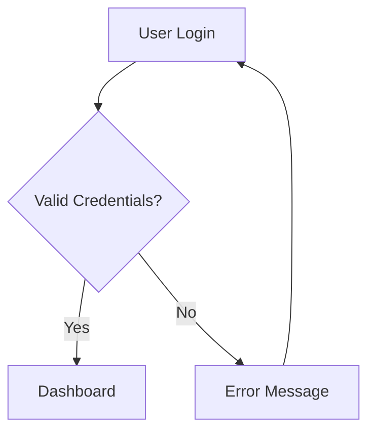
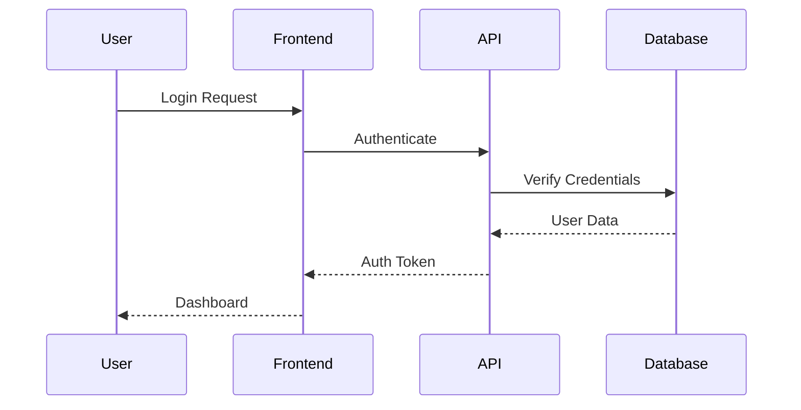
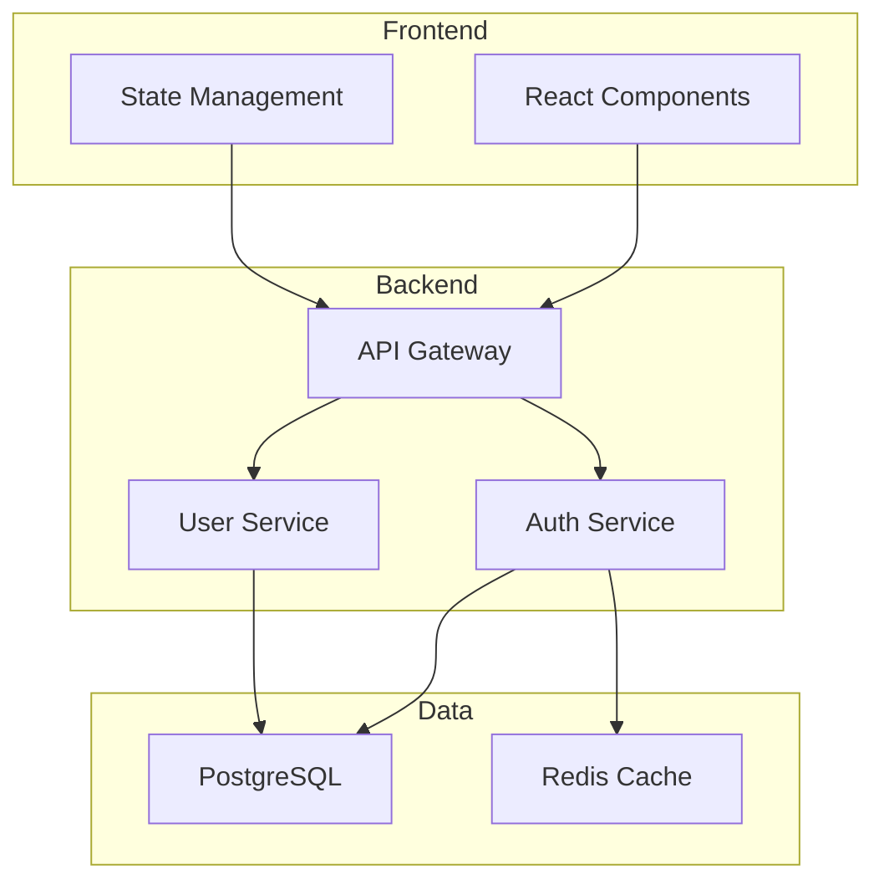

# Enhanced Create-Specs User Guide

> **Version:** 2.0.0  
> **Last Updated:** 2025-08-05  
> **Target Audience:** Agent OS users, developers, and teams

## Overview

The Enhanced Create-Specs workflow revolutionizes specification creation in the Agent OS ecosystem by adding visual documentation, cross-repository integration, and intelligent template variants while maintaining complete backward compatibility with existing workflows.

## Table of Contents

1. [Quick Start](#quick-start)
2. [Installation & Setup](#installation--setup)
3. [Template Variants](#template-variants)
4. [Command Reference](#command-reference)
5. [Cross-Repository Integration](#cross-repository-integration)
6. [Visual Documentation](#visual-documentation)
7. [Module Organization](#module-organization)
8. [Troubleshooting](#troubleshooting)
9. [Migration Guide](#migration-guide)
10. [Advanced Features](#advanced-features)

## Quick Start

### Basic Enhanced Spec Creation

```bash
# Enhanced spec with all features
/create-spec user-authentication auth enhanced

# Traditional spec (backward compatible)
/create-spec user-authentication

# Minimal spec for simple changes
/create-spec bug-fix utils minimal

# API-focused development
/create-spec user-api services api_focused
```

### What You Get

- **Enhanced Specs**: Prompt summaries, executive summaries, mermaid diagrams
- **Cross-Repository References**: Shared components from AssetUtilities hub
- **Visual Documentation**: Auto-generated system architecture diagrams
- **Template Variants**: 5 specialized templates for different use cases
- **Module Organization**: Clean, scalable folder structure

## Installation & Setup

### Prerequisites

- Agent OS framework installed and configured
- Access to AssetUtilities hub repository (for cross-repo features)
- Git repository initialized
- Python 3.8+ (for UV tool integration)

### Basic Setup

1. **Verify Agent OS Installation**
   ```bash
   # Check for Agent OS directory structure
   ls ~/.agent-os/instructions/
   # Should show: create-spec.md, execute-tasks.md
   ```

2. **Enable Enhanced Features** (Optional)
   ```bash
   # Create user preferences
   mkdir -p .agent-os
   cat > .agent-os/user-preferences.yaml << EOF
   preferred_variant: "enhanced"
   organization_type: "module-based"
   enable_mermaid_diagrams: true
   enable_cross_references: true
   auto_detect_sub_specs: true
   EOF
   ```

3. **Configure Cross-Repository Integration** (Optional)
   ```bash
   # Set up AssetUtilities hub integration
   cat > .agent-os/cross-repo-config.yaml << EOF
   hub_repository: "assetutilities"
   hub_path: "/path/to/assetutilities"
   shared_components:
     - "agent-os/enhanced-create-specs/enhanced_documentation_generator.py"
   version_requirements:
     hub: ">=1.0.0"
   EOF
   ```

### Verification

```bash
# Test enhanced spec creation
/create-spec test-spec testing enhanced

# Verify directory structure was created
ls specs/modules/testing/
# Should show: YYYY-MM-DD-test-spec/
```

## Template Variants

Choose the right template for your use case:

### 1. Minimal (`minimal`)
**Best for:** Bug fixes, simple changes, quick tasks

**Sections:**
- Overview
- User Stories  
- Spec Scope
- Expected Deliverable

**Command:** `/create-spec fix-login-bug auth minimal`

### 2. Standard (`standard`) - Default
**Best for:** Traditional Agent OS specs, general features

**Sections:**
- Overview
- User Stories
- Spec Scope
- Out of Scope
- Expected Deliverable

**Command:** `/create-spec user-dashboard frontend standard`

### 3. Enhanced (`enhanced`)
**Best for:** Complex features, new modules, comprehensive documentation

**Sections:**
- Prompt Summary
- Executive Summary with business impact
- System Overview with mermaid diagram
- Overview
- User Stories
- Spec Scope
- Out of Scope
- Expected Deliverable

**Command:** `/create-spec payment-system billing enhanced`

### 4. API Focused (`api_focused`)
**Best for:** API development, service integrations, microservices

**Sections:**
- Prompt Summary
- Executive Summary
- API Overview with endpoint diagram
- Overview
- User Stories
- Spec Scope
- Expected Deliverable

**Command:** `/create-spec user-api backend api_focused`

### 5. Research (`research`)
**Best for:** Exploratory work, proof of concepts, investigation

**Sections:**
- Prompt Summary
- Research Context
- Hypothesis
- Methodology
- Expected Findings
- Success Criteria

**Command:** `/create-spec performance-analysis optimization research`

## Command Reference

### Basic Commands

```bash
# Enhanced spec creation with all options
/create-spec <spec-name> [module-name] [variant] [options]

# Examples:
/create-spec auth-system authentication enhanced
/create-spec api-docs services api_focused
/create-spec bug-investigation utils research
/create-spec quick-fix frontend minimal
```

### Command Parameters

- **`spec-name`** (required): Descriptive name in kebab-case (max 5 words)
- **`module-name`** (optional): Module for organization (enables module-based structure)
- **`variant`** (optional): Template variant (minimal|standard|enhanced|api_focused|research)
- **`options`** (optional): Additional flags (--force, --dry-run, etc.)

### Enhanced Task Execution

```bash
# Execute tasks with enhanced tracking
/execute-tasks @specs/modules/auth/YYYY-MM-DD-auth-system/tasks.md

# Execute specific task with summaries
/execute-tasks @specs/modules/auth/YYYY-MM-DD-auth-system/tasks.md task-1.2
```

## Cross-Repository Integration

### AssetUtilities Hub

The enhanced workflow integrates with the AssetUtilities hub to share components across 17+ repositories.

#### Supported Repositories

**Engineering:** aceengineer-website, aceengineercode, digitalmodel, energy, rock-oil-field, saipem
**Project Management:** acma-projects, client_projects, investments, teamresumes
**Infrastructure:** assethold, pyproject-starter, worldenergydata
**Development:** ai-native-traditional-eng
**Documentation:** frontierdeepwater, OGManufacturing

#### Reference Patterns

```markdown
# Cross-repository component reference
@assetutilities:src/modules/agent-os/enhanced-create-specs/enhanced_documentation_generator.py

# Sub-agent reference
@assetutilities:agents/registry/sub-agents/workflow-automation

# Hub configuration reference
@assetutilities:hub-config.yaml

# Internal project reference
@.agent-os/product/mission.md

# Spec cross-reference
@specs/modules/auth/user-login-spec/spec.md
```

#### Shared Components Available

- **Enhanced Documentation Generator** - Core spec creation engine
- **Cross-Reference Manager** - Reference validation and resolution
- **Template Customization System** - Multi-variant template support
- **Workflow Automation** - Enhanced task execution and tracking
- **Performance Monitoring** - Benchmark and metrics collection

## Visual Documentation

### Mermaid Diagram Auto-Generation

The enhanced workflow automatically generates appropriate diagrams based on your spec type:

#### Flowchart Diagrams
**Used for:** User workflows, business processes, decision trees



#### Sequence Diagrams  
**Used for:** API interactions, system communications, user journeys



#### Component Diagrams
**Used for:** System architecture, module relationships, service dependencies



### Diagram Customization

You can customize diagrams by modifying the system overview section:

```markdown
## System Overview

Brief description of the system architecture and key components.

```mermaid
graph TB
    # Your custom mermaid diagram here
```

### Architecture Notes
Additional context about architectural decisions and rationale.
```

## Module Organization

### Directory Structure

Enhanced specs support both traditional and module-based organization:

#### Traditional Structure (Backward Compatible)
```
specs/
├── 2025-08-05-user-authentication/
│   ├── spec.md
│   ├── tasks.md
│   └── sub-specs/
└── 2025-08-06-payment-system/
    ├── spec.md
    └── tasks.md
```

#### Module-Based Structure (Enhanced)
```
specs/
└── modules/
    ├── authentication/
    │   ├── 2025-08-05-user-login/
    │   ├── 2025-08-06-oauth-integration/
    │   └── 2025-08-07-session-management/
    ├── payment/
    │   ├── 2025-08-08-payment-gateway/
    │   └── 2025-08-09-subscription-billing/
    └── frontend/
        └── 2025-08-10-user-dashboard/
```

### Module Benefits

- **Better Organization**: Logical grouping by functional area
- **Easier Navigation**: Find related specs quickly
- **Scalable Structure**: Supports subcategories for large modules
- **Cross-Reference Support**: Easy linking between related specs
- **Team Collaboration**: Clear ownership and responsibility boundaries

### Module Selection Guidelines

**Authentication Module:**
- User login/logout
- OAuth integrations
- Session management
- Password policies
- Multi-factor authentication

**API Module:**
- Endpoint definitions
- Service integrations
- Data contracts
- Rate limiting
- API versioning

**Frontend Module:**
- UI components
- User experience flows
- State management
- Client-side routing
- Progressive web app features

**Infrastructure Module:**
- Deployment configurations
- Monitoring and logging
- Database schemas
- Caching strategies
- Security configurations

## Troubleshooting

### Common Issues

#### 1. "Enhanced features not available"

**Symptoms:**
- `/create-spec` command only creates traditional specs
- No mermaid diagrams generated
- Missing prompt summary sections

**Solutions:**
```bash
# Check if enhanced instructions exist
ls .agent-os/instructions/enhanced-create-spec.md

# If missing, verify project setup
ls .agent-os/
# Should contain user-preferences.yaml

# Recreate user preferences
cat > .agent-os/user-preferences.yaml << EOF
preferred_variant: "enhanced"
organization_type: "module-based"
enable_mermaid_diagrams: true
EOF
```

#### 2. "Cross-repository references not resolving"

**Symptoms:**
- @assetutilities: references showing as broken
- Shared components not accessible
- Cross-reference validation failing

**Solutions:**
```bash
# Verify hub configuration
cat .agent-os/cross-repo-config.yaml

# Check hub repository access
ls /path/to/assetutilities/src/modules/agent-os/

# Update hub path if needed
sed -i 's|hub_path: ".*"|hub_path: "/correct/path/to/assetutilities"|' .agent-os/cross-repo-config.yaml
```

#### 3. "Mermaid diagrams not rendering"

**Symptoms:**
- Mermaid code blocks appear as plain text
- Visual documentation section empty
- Diagram syntax errors

**Solutions:**
```bash
# Verify mermaid is enabled in preferences
grep "enable_mermaid_diagrams: true" .agent-os/user-preferences.yaml

# Check spec variant supports diagrams
# Only enhanced, api_focused, and research variants include diagrams

# Validate mermaid syntax online: https://mermaid.live/
```

#### 4. "Module organization not working"

**Symptoms:**
- Specs created in traditional date-based structure
- Module directories not created
- Cross-references between modules failing

**Solutions:**
```bash
# Verify module-based organization is enabled
grep "organization_type: \"module-based\"" .agent-os/user-preferences.yaml

# Specify module explicitly in command
/create-spec feature-name module-name enhanced

# Create module directories manually if needed
mkdir -p specs/modules/{auth,api,frontend,infrastructure}
```

### Performance Issues

#### Slow Spec Creation

**Check:**
- Hub repository accessibility (network/disk speed)
- Component cache status
- Large number of cross-references

**Solutions:**
- Use cached mode: `--use-cache`
- Reduce cross-repository references
- Optimize hub repository location

#### Memory Usage

**Monitor:**
```bash
# Check memory usage during spec creation
ps aux | grep python
top -p <pid>
```

**Solutions:**
- Reduce concurrent spec operations
- Clear component cache: `rm -rf .agent-os/cache/`
- Use minimal variant for simple specs

### Getting Help

1. **Check Documentation**: Review this guide and linked resources
2. **Validate Configuration**: Use built-in validation commands
3. **Test in Isolation**: Create test spec to isolate issues
4. **Community Support**: GitHub discussions and issue tracker
5. **Professional Support**: Contact AssetUtilities hub team

## Migration Guide

### From Traditional to Enhanced Specs

#### Step 1: Assess Current Specs

```bash
# Count traditional specs
find specs/ -maxdepth 1 -type d -name "20*" | wc -l

# Identify candidates for enhancement
ls specs/20*/spec.md | head -5
```

#### Step 2: Enable Enhanced Features

```bash
# Create user preferences
cat > .agent-os/user-preferences.yaml << EOF
preferred_variant: "enhanced"
organization_type: "module-based"
enable_mermaid_diagrams: true
enable_cross_references: true
migration_mode: "gradual"
EOF
```

#### Step 3: Migrate Spec by Spec

```bash
# Create enhanced version of existing spec
/create-spec enhanced-user-auth authentication enhanced

# Copy relevant content from old spec
# Update references and add new sections
```

#### Step 4: Update Cross-References

```bash
# Find all cross-references to migrated specs
grep -r "@specs/20.*user.*auth" . 

# Update to new module-based paths
# @specs/modules/authentication/YYYY-MM-DD-enhanced-user-auth/
```

### From Single Repository to Hub Integration

#### Step 1: Set Up Hub Connection

```bash
# Clone or locate AssetUtilities hub
git clone https://github.com/user/assetutilities.git

# Configure cross-repository connection
cat > .agent-os/cross-repo-config.yaml << EOF
hub_repository: "assetutilities"
hub_path: "/path/to/assetutilities"
integration_type: "full"
shared_components:
  - "agent-os/enhanced-create-specs/enhanced_documentation_generator.py"
sub_agents:
  - "workflow-automation"
EOF
```

#### Step 2: Validate Hub Integration

```bash
# Test shared component access
ls /path/to/assetutilities/src/modules/agent-os/enhanced-create-specs/

# Verify version compatibility
cat /path/to/assetutilities/hub-config.yaml | grep version
```

#### Step 3: Update Existing Specs

```bash
# Add cross-repository references
# Replace local implementations with @assetutilities: references
# Update documentation to reference shared components
```

## Advanced Features

### Custom Template Variants

Create organization-specific template variants:

```bash
# Create custom variant directory
mkdir -p .agent-os/templates/custom-variants/

# Define custom variant
cat > .agent-os/templates/custom-variants/mobile-app.yaml << EOF
name: "mobile_app"
display_name: "Mobile Application"
sections:
  - "prompt_summary"
  - "user_experience_requirements"
  - "platform_compatibility"
  - "performance_requirements"
  - "app_store_considerations"
  - "expected_deliverable"
mermaid_diagram_type: "user_journey"
sub_specs:
  - "platform-specific-implementation"
  - "app-store-submission"
EOF
```

### Performance Monitoring

Enable performance tracking for spec creation:

```bash
# Enable performance monitoring
cat >> .agent-os/user-preferences.yaml << EOF
performance_monitoring: true
benchmark_targets:
  spec_creation_time: 3000  # ms
  cross_reference_validation: 1000  # ms
  mermaid_generation: 500  # ms
EOF
```

### Batch Operations

Process multiple specs efficiently:

```bash
# Create multiple related specs
/create-spec-batch auth authentication enhanced << EOF
user-login
oauth-integration  
session-management
password-reset
multi-factor-auth
EOF
```

### Integration with IDEs

#### VS Code Integration

```json
// .vscode/settings.json
{
  "agent-os.enhanced-specs.enabled": true,
  "agent-os.cross-repo.hub-path": "/path/to/assetutilities",
  "agent-os.templates.default-variant": "enhanced",
  "agent-os.organization.type": "module-based"
}
```

#### Custom Snippets

```json
// .vscode/snippets/agent-os-enhanced.json
{
  "Enhanced Spec Creation": {
    "prefix": "create-spec",
    "body": [
      "/create-spec ${1:spec-name} ${2:module-name} ${3|minimal,standard,enhanced,api_focused,research|}"
    ],
    "description": "Create enhanced Agent OS specification"
  }
}
```

### API Integration

Programmatic spec creation:

```python
# Python API example
from assetutilities.agent_os import EnhancedSpecCreator

creator = EnhancedSpecCreator(
    variant='enhanced',
    organization_type='module-based',
    hub_config='/path/to/hub-config.yaml'
)

spec = creator.create_spec(
    name='user-authentication',
    module='auth',
    requirements={
        'prompt_summary': {
            'original_request': 'Implement OAuth login',
            'context_provided': 'Existing user system',
            'clarifications_made': ['Google OAuth', 'GitHub OAuth']
        },
        'business_impact': {
            'user_experience': 'Faster login process',
            'security_improvement': 'Centralized authentication'
        }
    }
)
```

---

## Conclusion

The Enhanced Create-Specs workflow provides a powerful, flexible, and scalable approach to specification management in the Agent OS ecosystem. With support for visual documentation, cross-repository integration, and intelligent template variants, teams can create comprehensive, maintainable specifications that serve as the foundation for successful software development projects.

For additional support, examples, and community resources, visit:
- **GitHub Repository**: https://github.com/user/assetutilities
- **Documentation Hub**: @assetutilities:docs/modules/agent-os/
- **Community Discussions**: GitHub Discussions
- **Issue Tracker**: GitHub Issues

---

*This guide is maintained by the AssetUtilities Hub Team and updated regularly with new features and improvements.*