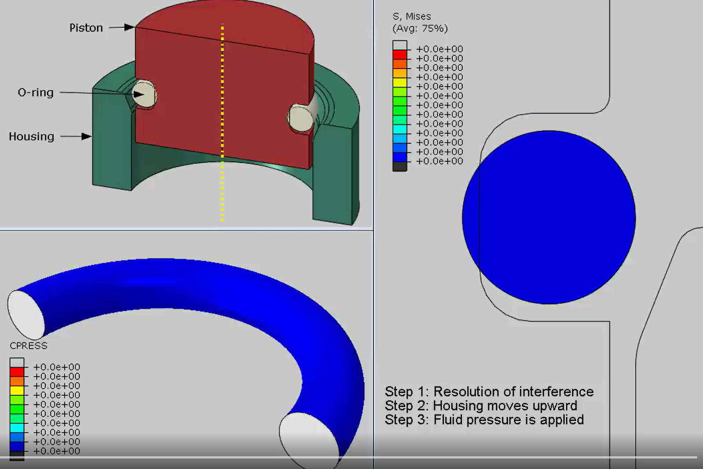
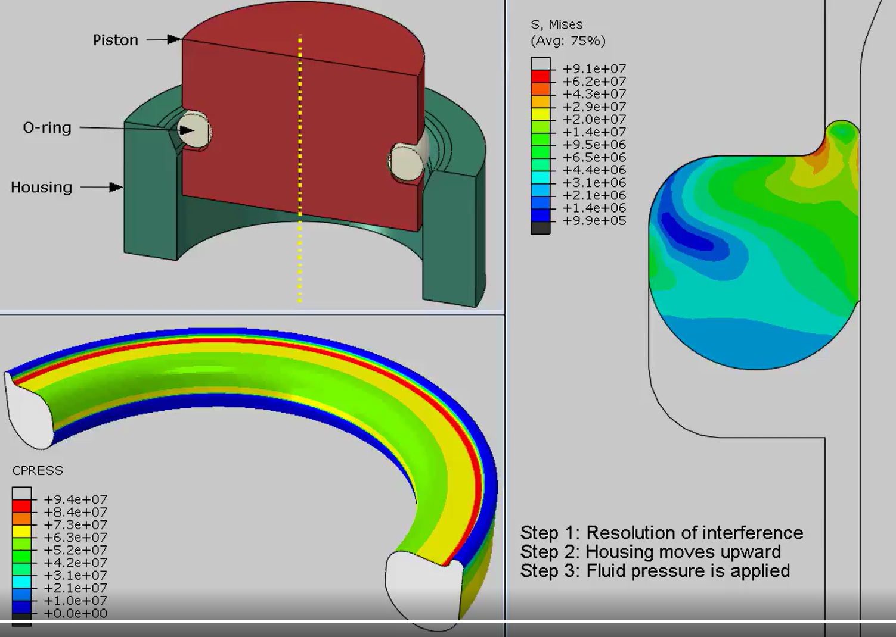

## Seals

https://www.linkedin.com/feed/update/urn:li:activity:7103972555174088704?utm_source=share&utm_medium=member_desktop

Simulation of an o-ring seal subjected to pressure of a fluid.

The analysis is performed in three steps. In the first step, interference is resolved and in the second step housing is moved upwards. In the third step, a fluid pressure is applied. A very good example to show how an axisymmetric model can reduce computational cost significantly.

