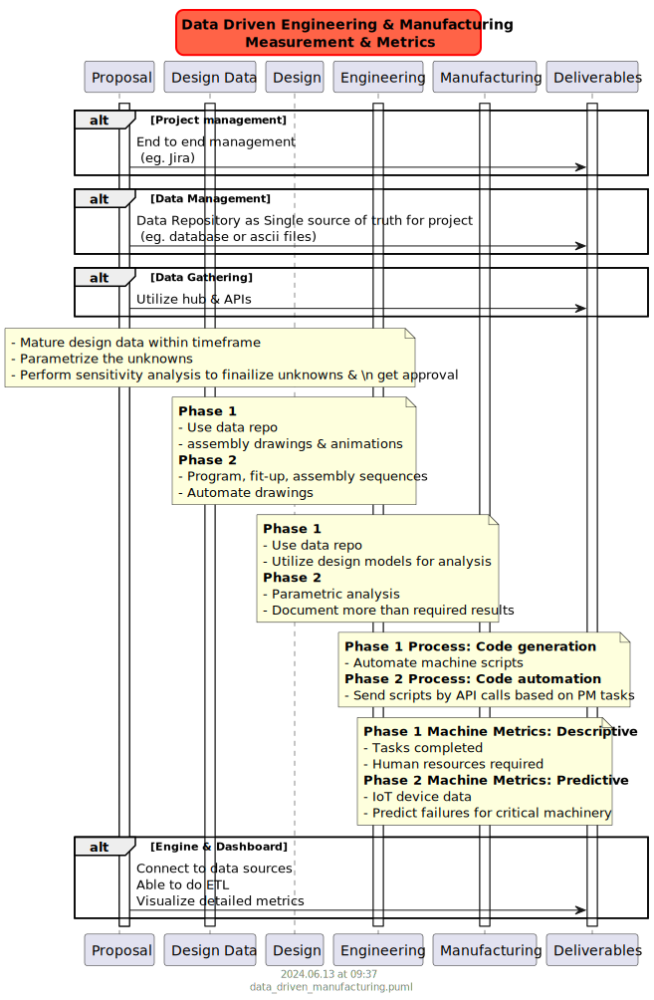

## Introduction

Data Driven manufacturing can help achieve a design from single source of truth. All the activities of design, engineering and manufacturing processes.

A custom product is manufactured in a lot of sectors. Oil and Gas drilling industry requires lot of components, pressure vessels. 

## Summary

The idea is to drive all the manufacturing processes with a single source of truth. 

## Basecase Scenario

Typical manufacturing process involves the following:
- Design
- Engineering
- Manufacturing
    - Procurement
    - Fabrication
    - Testing
        - Fit-up
        - Pressure Test
        - Load Test
    - Finish
    - Shipping
- Deliverables
    - Product
    - Manufacturer databook

**Storage:** 
    - A neutral database, preferably, a traditional SQL database
    - Should interface with all software (additional tools required)
**Design Software:**
    - Solidworks or Autodesk or others?
**Engineering:**
    - Any analysis required should be as parametric as possible. Document component analysis with parametric analysis to utilize in future designs
    - Anticipate the test data required to verify design. Document all analysis in graphic and tabular format for easy verification
    - Minimize requirement to rerun analysis
    - Script oriented engineering analysis (eg; ANSYS or Abacus with Python scripting)
**Manufacturing:**
    - Prepare a schedule from procuremnet 
    - Show animations of the product as it progresses through the schedule
    - Document all steps in project management tool
    - Add all the documentation to product data room as databooks arrive
    - Demonstrate all the fit-up tests to ensure things fit
    - Document strain from pressure and load tests 
        - Compare data against analysis report in 1-2 page technical note with reference documents as appendices
**Deliverables:**
    - Product
    - Manufacturer Book

Example companies following good reporting:
https://www.entail.no/
https://www.entail.no/lifting-campaign
https://www.entail.no/engineering-automation

A full concept in a manufacturing plant  is shown below. Parts of these have been implemented at various faclities. A full solution implementation will help get competitive edge:

### References

[https://www.machinemetrics.com/blog/data-driven-manufacturing](https://www.machinemetrics.com/blog/data-driven-manufacturing)

[https://www.machinemetrics.com/manufacturing-analytics-software](https://www.machinemetrics.com/manufacturing-analytics-software)
https://www.entail.no/
https://www.entail.no/lifting-campaign
https://www.entail.no/engineering-automation (Why automate?)
