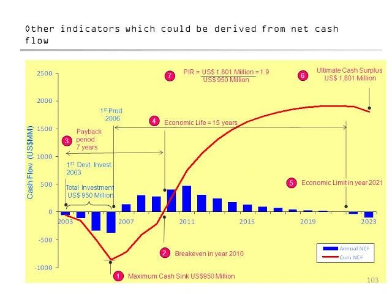

𝗣𝗲𝘁𝗿𝗼𝗹𝗲𝘂𝗺 𝗘𝗰𝗼𝗻𝗼𝗺𝗶𝗰𝘀 𝗜𝗻𝗱𝗶𝗰𝗮𝘁𝗼𝗿𝘀 
Petroleum economics involves the analysis and evaluation of the financial aspects of the petroleum industry, including the exploration, production, refining, and marketing of petroleum products. Various indicators are used to assess the profitability, efficiency, and overall performance of companies and projects in the petroleum sector. This article explores some of the key petroleum economics indicators commonly used in the industry.

1. Net Present Value (NPV):
NPV is a financial indicator used to assess the profitability and value of a petroleum project over its lifetime. It calculates the present value of the project's expected cash flows, taking into account factors such as oil price forecasts, production costs, and discount rates. A positive NPV indicates that the project is expected to generate value, while a negative NPV suggests that the project may not be economically viable.

2. Internal Rate of Return (IRR):
IRR is a percentage rate that represents the average annual rate of return generated by an investment in the petroleum sector. It is the discount rate at which the NPV of the project becomes zero. The IRR is used to compare and evaluate different investment opportunities within the petroleum industry and helps determine the attractiveness of a project's financial returns.

