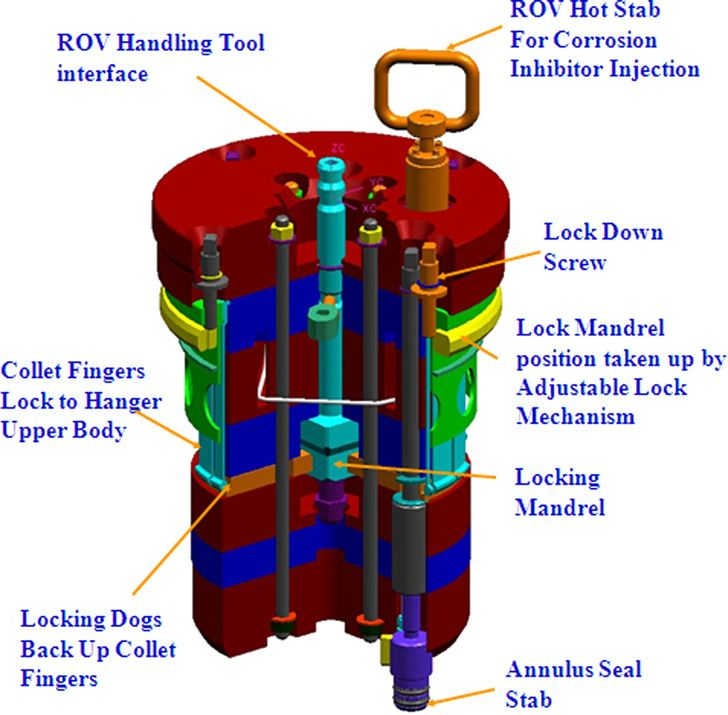

## Subsea Tree Debris Cap

https://www.linkedin.com/posts/ahmedbassiounymohamed_subsea-subseaengineering-offshore-ugcPost-7100126404633067520-YIkz

Tree caps are designed to both prevent fluid from leaking from the wellbore
into the environment and small dropped objects from getting into the mandrel. Designs are very different between HXTs and VXTs. Tree caps are usually designed to be recoverable for easy maintenance. The debris cap covers the top of the tree spool. It is installed, locked, unlocked, released, and recovered via ROV-assisted operations.
The tree cap in a VXT system has the functions of providing the control interfaces during workover and sealing the tree from seawater ingress. An HXT, in contrast, has internal tree caps and tree debris caps.

An internal tree cap is designed to latch onto the spool body above the tubing hanger and seal off the area above the tubing hanger to the maximum rated working pressure. It is installed through the marine riser and latches full within the bore of the horizontal tree and should provide primary metal-to-metal and secondary elastomeric seals to isolate the internal tree from the environment. Figure below illustrates a configuration for an ROV-operated internal tree cap.

