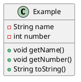

## Introduction
The ability to draw ascii drawings and help project participants. Drawings and diagrams can benefit developers, architects, project sponsors etc. PlantUML is a component that allows to quickly write and generate drawings and diagrams using basic ascii code. 

This document describes the following:
- A method to prepare drawings to steamline project work and development etc.
- How to write source in asciidoc + PlantUML; 
- How to get rendered in HTML + PNG on github markdown pages.

## Summary

The advantages to ascii code based drawings or diagrams such as plantuml are:
- Ability to quickly generate drawings from ground up
- Ability to quickly edit to update/correct drawings to keep sync with code
- Integrate drawings in markdown files using general CI/CD practices

Best practices:
- Always save each plantuml drawing as individual files
  - helps in easy CI-CD
  - facilitates easy use of templates
  - facilitates easy use existing flowcharts for new flowchart

[https://blog.anoff.io/2018-07-31-diagrams-with-plantuml/](https://blog.anoff.io/2018-07-31-diagrams-with-plantuml/)
[https://stackoverflow.com/questions/32203610/how-to-integrate-uml-diagrams-into-gitlab-or-github/32771815#32771815](https://stackoverflow.com/questions/32203610/how-to-integrate-uml-diagrams-into-gitlab-or-github/32771815#32771815)

Good starting examples (and reference links) are given below:

[https://real-world-plantuml.com/](https://real-world-plantuml.com/)

[https://paircoders.com/2019/06/05/create-sequence-diagrams-with-plantuml/](https://paircoders.com/2019/06/05/create-sequence-diagrams-with-plantuml/)

[https://forum.plantuml.net/9735/participant-text-overflows-from-the-right-of-its-box](https://forum.plantuml.net/9735/participant-text-overflows-from-the-right-of-its-box)

## Installation

Install plantuml using the below command:
- choco install plantuml
- troubleshooting - chocolatey not installed:
  - error: "choco : The term 'choco' is not recognized as the name of a cmdlet, function, script file, or operable program. Check   the spelling of the name, or if a path was included, verify that the path is correct and try again"
  - ensure chocolatey is installed on the computer. 
  - https://chocolatey.org/install

# Working in

Plantuml can be worked in various methods:

## Browser

Prerequisites:
- Need a working (error less) .puml (or .plantuml) code for use

The following link can be used to generate drawings. Paste the .puml data into the below link. One should get the chart.
http://www.plantuml.com/plantuml/uml/SyfFKj2rKt3CoKnELR1Io4ZDoSa70000

## IDE

Prerequisites:
- Need a working (error less) .puml (or .plantuml) code for use
- Installation installed on the computer

An plantuml extension or utility can be used to render in an IDE. Instructions for IDE(s) is given in this section.
### VS Code

- Install the extension 'PlantUML' in VS code
  - [https://marketplace.visualstudio.com/items?itemName=jebbs.plantuml](https://marketplace.visualstudio.com/items?itemName=jebbs.plantuml)
- Set up custom location to save files

- Exporting images to other formats using plantuml extension
  - 
  - 
  - Click option to 'Export Workspace Diagrams' 
  - choose the format to save diagrams

---
Previous slide

---

# Display plantuml diagram inline
Prerequisites:
- Install plantuml
  - Set the following in vs code user (or workspace based on preference) settings
  <pre>
      "plantuml.server": "https://www.plantuml.com/plantuml",
  </pre>

- install markdown preview enhanced extension: 
https://marketplace.visualstudio.com/items?itemName=shd101wyy.markdown-preview-enhanced

---
Next slide

---

Typical errors and how to resolve them:
- Error: Diagram unnamed. Try "@startuml name"
  - Resolution: 

References:
https://stackoverflow.com/questions/66934681/using-plantuml-within-a-markdown-document

## Github Integration

Github integration will greatly help streamline implementation. A method to implement a stand-alone file inline with a markdown file is given in this section.

- Create an individual plantuml file. An example plantuml file saved in location [https://github.com/vamseeachanta/energy/blob/master/tools/puml/wbs.puml](https://github.com/vamseeachanta/energy/blob/master/tools/puml/wbs.puml) with below code:

<pre><code>
'''
@startwbs
* Project Organization
** Procure project work
*** Perosn 1
*** Perosn 2
** US Resources
*** Technical Project Manager
*** Doc Controller/BA
** Project Resources
*** Project manager (scrum master/planning/release train)
*** 2 Fullstack developers
*** 1 Devops/Automation
*** 1 PowerBI + SQL
*** 1 Scrum master + release train
@endwbs
'''
</code></pre>

- The below format is defined in markdown (.md) file:
  - http://www.plantuml.com/plantuml/proxy?cache=no&src=(raw github plantuml link)
- Key things to note are:
  - raw github file link can be obtained from actual githublink file link
  - cache=no will allow to seamlessly update image along with code
- Example format is below of a file in repo is below
  - http://www.plantuml.com/plantuml/proxy?cache=no&src=https://raw.githubusercontent.com/vamseeachanta/energy/master/tools/puml/wbs.puml

- Exact code used in markdown is:
<pre><code>

</code></pre>

- The rendering of the example file in github is:

### Other IDEs

For developers, getting it to work in in other IDEs may be difficult.

## Standard schematics

### gantt

https://plantuml.com/gantt-diagram

## Tips and Tricks
### Command line execution

If plantuml extenion is installed in vs code, execute below in VS code terminal
plantuml "C:\Users\Vamsee Achanta\GitHub\energy\tools\puml\gantt.puml"

Output file will be saved in same folder as the root folder. The default output is typically .png

<pre><code>
plantuml -png "C:\Users\Ganga\GitHub\client_projects\energy_engineering\rii\004 telescopic jt schedule\21in_RD_termination_adaptor_gantt.puml"
plantuml -svg "C:\Users\Ganga\GitHub\client_projects\energy_engineering\rii\004 telescopic jt schedule\21in_RD_termination_adaptor_gantt.puml"
</code></pre>

Reference:
https://plantuml.com/command-line

### Custom Styling

Custom change line style and color. The code is self-explanatory if familiar with plantuml

<pre><code>
@startuml

' Make a dashed line, alternative syntax for ..>
(*) -[dashed]-> "Write outline"

' Make line bold and use color name
"Write outline" -[bold,#green]-> "Find example"

' Only change the color with hexadecimal RGB code
"Find example" -[#ff00ff]-> "Write blog"

' Order of line style and color can be reversed
"Write blog" -[#6666ff,dashed]-> "Publish"

' Use dotted line style
"Publish" -[dotted]-> (*)

@enduml
</code></pre>

https://blog.jdriven.com/2017/01/plantuml-pleasantness-change-line-style-color/

### Commenting Code

Comment out portions of the diagram syntax

<pre><code>
@startuml
' This is a comment on a single line
Bob->Alice : hello
/' You quote alors use slash-and-quote
to split your comments on several
lines '/
@enduml
</code></pre>

https://forum.plantuml.net/1353/is-it-possible-to-comment-out-lines-of-diagram-syntax

## References

- [https://plantuml.com/](https://plantuml.com/)

- [https://plantuml.com/sitemap-language-specification](https://plantuml.com/sitemap-language-specification)

- [https://marketplace.visualstudio.com/items?itemName=jebbs.plantuml](https://marketplace.visualstudio.com/items?itemName=jebbs.plantuml)

- [https://www.reddit.com/r/git/comments/j6zaji/plant_uml_alternative_is_there_a_good_tool_for/](https://www.reddit.com/r/git/comments/j6zaji/plant_uml_alternative_is_there_a_good_tool_for/)

- [https://www.codeproject.com/Articles/1278703/UML-Made-Easy-with-PlantUML-VS-Code](https://www.codeproject.com/Articles/1278703/UML-Made-Easy-with-PlantUML-VS-Code)

- [https://www.linux-magazine.com/Issues/2020/235/PlantUML-Diagrams/(offset)/3](https://www.linux-magazine.com/Issues/2020/235/PlantUML-Diagrams/(offset)/3)

- [https://github.github.com/gfm/](https://github.github.com/gfm/)

https://mattjhayes.com/2021/11/28/other-uses-for-plantuml/

https://github.com/mattjhayes/PlantUML-Examples

https://www.freecodecamp.org/news/inserting-uml-in-markdown-using-vscode/